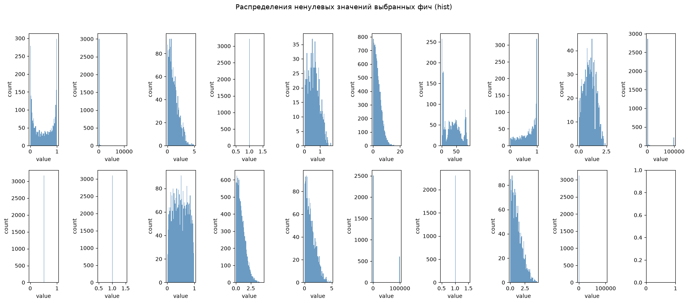
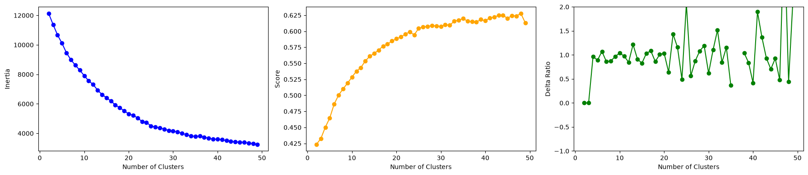
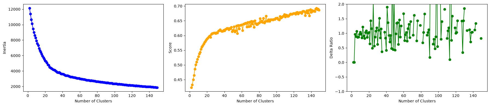
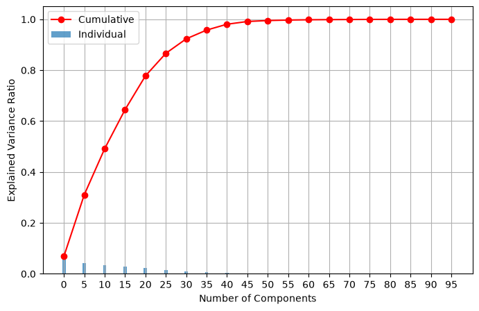
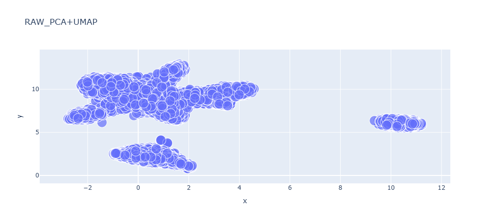
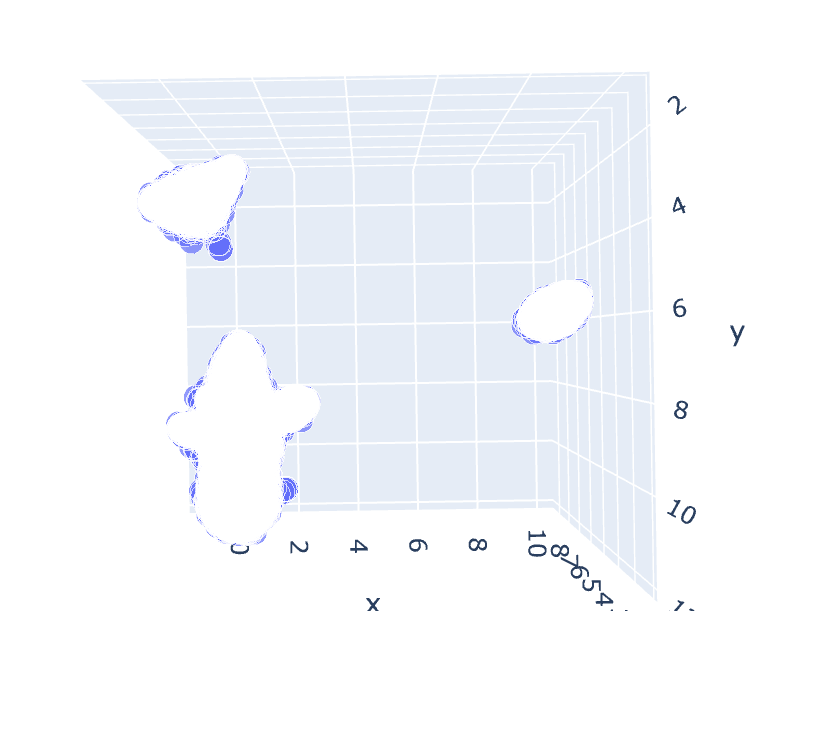
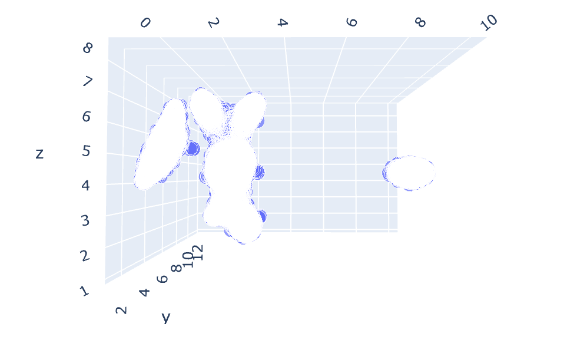
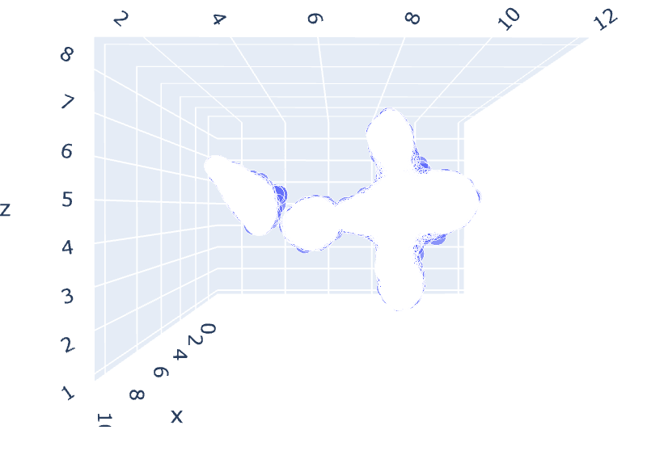
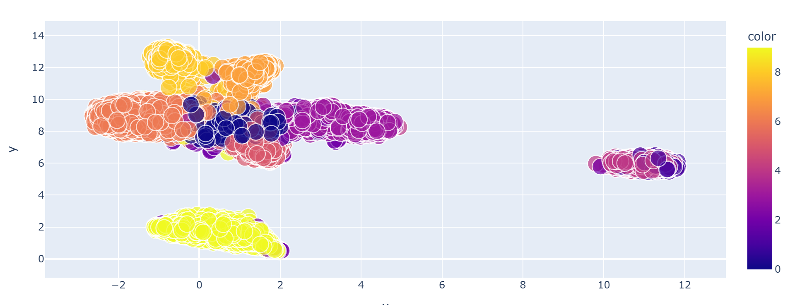
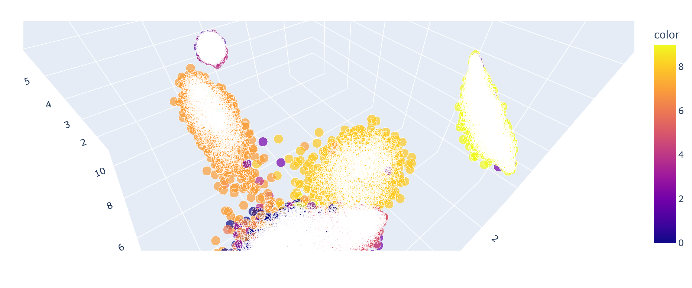

# Кластеризация разреженных данных

Проект по кластеризации разреженного датасета с подбором оптимального числа кластеров и лучшей модели.

## Целевая метрика

**Adjusted Rand Score** - метрика согласованности предсказанного разбиения с истинным, скорректированная на случайность.  
**Финальный скор = 0.84888**

## Данные

Разреженная матрица размером **(21000, 3049)**:

- Среднее значение: **2.5**
- (min, max): **(−13.81, 7598.59)**
- В среднем каждый семпл имеет **~500 ненулевых значений**

Распределения признаков:

Точная природа данных неизвестна, но они могут описывать задачу, связанную с **NLP** или **recsys**.

## Preprocessing

Пробовал использовать `StandardScaler`, `RobustScaler`, `Normalizer`, но при проверке количества компонент с помощью **elbow method** получал нестабильное соотношение приростов функционала k-means при увеличении числа кластеров, а также неограниченное улучшение метрики **silhouette**.   

  

Что говорит о том, что данные не выпуклые и надо использовать алгоритмы которые могут выделять кластера разных плотностей и пересекающиеся кластера. Это такие алгоритмы как: GaussianMixture, SpectralClustering.

Так как данные по большей части (**17/20 случаев**) не имеют больших выбросов (см. распределения выше), можно использовать `StandardScaler(with_centering=False)`, чтобы не сломать разреженность матрицы.

## PCA

PCA сохраняет **98% дисперсии** данных при сжатии до **40 компонент**.

## UMAP

Ниже приведены сжатые пространства, полученные алгоритмом **UMAP**.

2D-проекция:

3D-проекции (в разных плоскостях):

По изображениям видно, что должно получиться примерно **8–15 кластеров**.

С помощью библиотеки `multiprocessing` пишем асинхронный скрипт для перебора параметров по сетке(см. `multiproc_script.py`) и выбираем лучшую модель.

## Результаты кластеризации

В результате получили кластеризованные данные.

2D-представление:

3D-представление:

**Интерактивный график** кластеризованного пространства (можно вращать и рассматривать со всех сторон) доступен здесь: [images/html/clusstered_data.html](images/html/clusstered_data.html).

> Файл интерактивный - откройте его в браузере, чтобы вращать и приближать 3D-сцену.

## Выводы

- Лучший скор **Adjusted Rand Score** показала модель с **10 кластерами**, что совпадает с предположением по UMAP-визуализациям.
- На изображении заметно, что кластеры, расположенные далеко друг от друга, отмечены разными цветами.
- При обработке данных можно использовать `StandardScaler(with_centering=False)` или обычный `StandardScaler()` - скор примерно одинаковый: **0.84363** и **0.84888** соответственно.

## Стек технологий и методов

**Языки и среда:**
- Python
- Jupyter Notebook

**Работа с данными:**
- `numpy`, `pandas` - обработка данных
- `scipy.sparse` - работа с разреженной матрицей

**Препроцессинг и снижение размерности:**
- `StandardScaler` (в т.ч. `with_centering=False` для сохранения разреженности)
- `PCA` - снижение размерности с сохранением 98% дисперсии
- `UMAP` - нелинейное снижение размерности для визуализации

**Кластеризация и подбор параметров:**
- `GaussianMixture` - основная модель кластеризации
- `ParameterGrid` - перебор гиперпараметров по сетке
- `multiprocessing` - параллельный перебор моделей
- Elbow method и `silhouette_score` - анализ числа кластеров
- **Adjusted Rand Score** - целевая метрика качества

**Визуализация:**
- `matplotlib` - статические графики
- `plotly` - интерактивные 3D/2D визуализации кластеров
- `seanorn` - для color_palette

**Инфраструктура:**
- Kaggle CLI - автоматическая отправка сабмишенов
